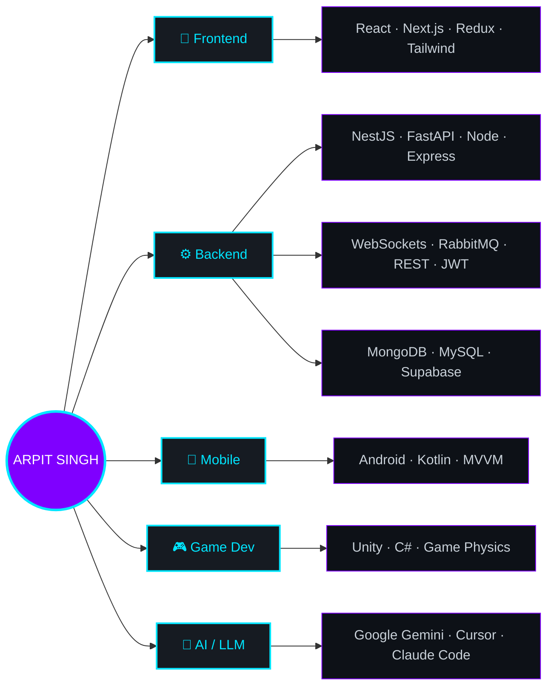

<!--
  ════════════════════════════════════════════════════════════════
  GITHUB PROFILE README  →  goes in repo:  TSM-ArpitSG/TSM-ArpitSG
  (create a PUBLIC repo named exactly "TSM-ArpitSG", add this as README.md)
  Theme: dark neon (cyan #00E5FF + purple #7F00FF) on GitHub dark (#0d1117)
  Looks best in GitHub DARK mode.
  ════════════════════════════════════════════════════════════════
-->

<!-- ░░░░░░░░░░ ANIMATED HEADER ░░░░░░░░░░ -->
<div align="center">


<a href="https://github.com/TSM-ArpitSG">
  
</a>

<br>


</div>

<!-- ░░░░░░░░░░ WHOAMI ░░░░░░░░░░ -->
## 🧬 `whoami`

```python
class ArpitSingh:
    def __init__(self):
        self.role        = "Software Engineer @ Katyayani Organics"
        self.education   = "B.Tech CSE (Gaming Technology), VIT Bhopal — 8.67/10"
        self.location    = "Bhopal, India 🇮🇳  (open to remote, worldwide)"
        self.stack       = ["Python/FastAPI", "TypeScript/NestJS", "React/Next.js",
                            "MongoDB", "Android/Kotlin", "Unity/C#"]
        self.building    = "real-time systems · RBAC · message-driven microservices"
        self.superpower  = "shipping fast with AI-assisted dev (Cursor, Claude Code)"
        self.off_screen  = ["gamer 🎮", "guitar 🎸", "aspiring content creator 🎥"]

    def say_hi(self):
        return "Thanks for stopping by — let's build something cool. 👋"
```

- 🔭 Currently engineering **real-time SLA systems, role-based access control, and RabbitMQ-driven microservices** across **Python (FastAPI) + TypeScript (NestJS) + React**.
- 🎮 **Gaming-Technology** background — Unity, C#, game physics, computer graphics, AR/VR.
- 🤖 I love building **AI-powered apps** with **Google Gemini**, and turning prompts into shipped product.
- 🧠 **365-day LeetCode streak** · **Google Kick Start 2020 — Global Rank 475**.
- 🌱 Going deeper on **distributed systems & system design** — and someday, an indie game + a dev YouTube channel.
- ⚡ Fun fact: my favorite move is turning *"that's not possible in MP / remote"* into *"shipped."*

<!-- ░░░░░░░░░░ TECH ARSENAL ░░░░░░░░░░ -->
## 🛠️ Tech Arsenal

<div align="center">

**🧩 Languages**
<br>


**🎨 Frontend**
<br>


**⚙️ Backend & Data**
<br>


**🎮 Mobile · Game · Tools**
<br>


<br>


</div>

<!-- ░░░░░░░░░░ HOW I BUILD — native Mermaid diagram (renders on GitHub, no external service) ░░░░░░░░░░ -->
## 🧠 How I Build



<!-- ░░░░░░░░░░ FEATURED PROJECTS ░░░░░░░░░░ -->
## 🚀 Featured Projects

<div align="center">

<a href="https://github.com/TSM-ArpitSG/tripcraft-ai">
  
</a>
<a href="https://github.com/TSM-ArpitSG/trao-weather-ai">
  
</a>

<a href="https://github.com/TSM-ArpitSG/Katyayani-Organics">
  
</a>
<a href="https://github.com/TSM-ArpitSG/Harry-Potter-Wiki">
  
</a>

</div>

- 🧳 **TripCraft AI** — AI trip-itinerary planner with JWT auth, day-by-day plans, budgets & hotel picks. `Next.js 15 · React 19 · Node · MongoDB · Gemini`
- 🌦️ **Trao Weather AI** — multi-user weather dashboard with AI insights & a layered backend. `Next.js · TypeScript · Node · MongoDB · OpenWeather + Gemini`
- ✅ **Task Manager** — full-stack JWT task app with Redux state & glassmorphism UI. `React 18 · TS · Vite · Node · MongoDB`
- 🪄 **Harry Potter Wiki** — themed interactive web app. `HTML · CSS · JS`
- 🎮 **Unity Games** — *Shooting Impulse* (2D shooter, adaptive difficulty) & *Coin Collector* (2D arcade). `Unity · C#`

<!-- ░░░░░░░░░░ GITHUB STATS ░░░░░░░░░░ -->
## 📊 GitHub Stats

<div align="center">


<br>


</div>

<!-- OPTIONAL — lowlighter/metrics isometric infographic.
     After you set up metrics.yml (needs a METRICS_TOKEN secret), remove this comment wrapper to show it:
<div align="center">

</div>
-->

<!-- ░░░░░░░░░░ ACTIVITY GRAPH ░░░░░░░░░░ -->
## 📈 Contribution Graph

<div align="center">

</div>

<!-- ░░░░░░░░░░ 3D CONTRIBUTION CALENDAR (yoshi389111 action) ░░░░░░░░░░ -->
## 🧊 3D Contribution Calendar

<div align="center">

</div>

<!-- ░░░░░░░░░░ TROPHIES ░░░░░░░░░░ -->
## 🏆 Trophies

<div align="center">

</div>

<!-- ░░░░░░░░░░ SNAKE ░░░░░░░░░░ -->
## 🐍 Watch the Snake Eat My Contributions

<div align="center">

</div>

<!-- ░░░░░░░░░░ PROFILE SUMMARY ░░░░░░░░░░ -->
## 🧾 Profile Summary

<div align="center">


</div>

<!-- ░░░░░░░░░░ DEV QUOTE ░░░░░░░░░░ -->
## 💭 Dev Quote of the Day

<div align="center">

</div>

<!-- ░░░░░░░░░░ CONNECT ░░░░░░░░░░ -->
## 🤝 Let's Connect

<div align="center">

<a href="https://linkedin.com/in/arpit-sg"></a>
<a href="mailto:arpit.singh2019@vitbhopal.ac.in"></a>
<a href="https://github.com/TSM-ArpitSG"></a>

<br><br>

<i>💬 Open to remote / MP-based SDE & full-stack roles — let's talk!</i>

<br><br>

<!-- retro visitor counter (community comeback) -->


</div>

<!-- ░░░░░░░░░░ FOOTER ░░░░░░░░░░ -->

